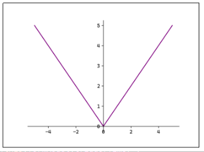
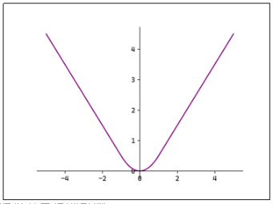
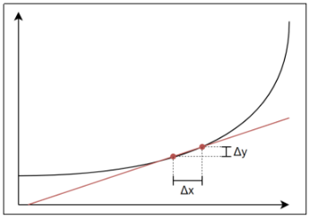
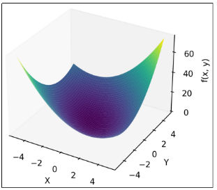
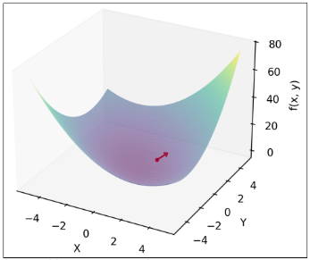
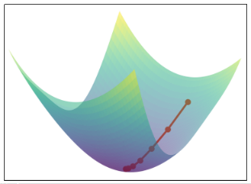

## 第03章_神经网络的学习

------

神经网络的主要特点，就是可以从数据中进行“学习”。这个学习的过程，就是让训练数据自动决定最优的权重参数。

神经网络（深度学习）也是机器学习的一种；跟传统机器学习方法相比，神经网络不需要人工设置 **特征量**（如 SIFT、HOG 等），这样就可以用同样的流程直接处理所有问题了。

### 3.1 损失函数

神经网络中，需要以某个指标为线索来寻找最优权重参数；这个指标就是 **损失函数（loss function）**；

#### 3.1.1 常见损失函数

- 均方误差（MSE）

  均方误差（Mean Squared Error，MSE），也称 L2 Loss：
  $$
  L = \frac{1}{n} \sum_{i=1}^n (y_i - t_i)^2
  $$
  其中，$$y_i$$ 表示神经网络的输出，$$t_i$$ 表示监督数据的标签（正确的解标签），$$n$$ 则是数据的“维度”。对于固定维度的网络，前面的系数 $$n$$ 不重要，因此公式有时也可以写成：

  $$
  L = \frac{1}{2} \sum_{i=1}^n (y_i - t_i)^2
  $$
  L2 Loss 对异常值敏感，遇到异常值时易发生梯度爆炸。

  ```python
  def mean_squared_error(y, t):
      return 0.5 * np.sum((y-t)**2)
  ```

- 交叉熵误差

  除均方误差之外，交叉熵误差（Cross Entropy Error）也经常被用作损失函数：

  $$
  L = -\sum_{i=1}^n t_i \log y_i
  $$
  其中，log 表示自然对数，$$y_i$$ 表示神经网络的输出，$$t_i$$ 表示正确解标签；而且，$$t_i$$ 中只有正确解标签对应的值为 1，其它均为 0（one-hot 表示）。

  ```python
  def cross_entropy_error(y, t):
      if y.ndim == 1:
          t = t.reshape(1, t.size)
          y = y.reshape(1, y.size)
  
      # 监督数据是one-hot向量的情况下，转换为正确解标签的索引
      if t.size == y.size:
          t = t.argmax(axis=1)
  
      batch_size = y.shape[0]
      return -np.sum(np.log(y[np.arange(batch_size), t] + 1e-7)) / batch_size
  ```

#### 3.1.2 分类任务损失函数

1. 二分类任务损失函数

   二分类任务常用二元交叉熵损失函数（Binary Cross-Entropy Loss）。

   $$
   L = -\frac{1}{n} \sum_{i=1}^n \left( y_i \log \hat{y}_i + (1 - y_i) \log (1 - \hat{y}_i) \right)
   $$
   其中：

   - $$y_i$$ 为真实值（通常为 0 或 1）
   - $$\hat{y}_i$$ 为预测值（表示样本 $$i$$ 为 1 的概率）

2. 多分类任务损失函数

   多分类任务常用多类交叉熵损失函数（Categorical Cross-Entropy Loss）。它是对每个类别的预测概率与真实标签之间差异的加权平均。

   $$
   L = -\frac{1}{n} \sum_{i=1}^n \sum_{c=1}^C y_{i,c} \log \hat{y}_{i,c}
   $$
   其中：

   - C 是类别数
   - $$y_{i,c}$$ 为真实值（表示 $$y_i$$ 是否为类别 c，通常为 0 或 1）
   - $$\hat{y}_{i,c}$$ 为预测值（表示样本 i 为类别 c 的概率）

#### 3.1.3 回归任务损失函数

1. MAE

   平均绝对误差（Mean Absolute Error，MAE），也称 L1 Loss：
   $$
   L = \frac{1}{n} \sum_{i=1}^n |y_i - \hat{y}_i|
   $$
   

   L1 Loss对异常值的鲁棒，但在0点处不可导；

2. MSE

   均方误差（Mean Squared Error，MSE），也称 L2 Loss：

   $$
   L = \frac{1}{n} \sum_{i=1}^n (y_i - \hat{y}_i)^2
   $$
   L2 Loss对异常值敏感，遇到异常值时易发生梯度爆炸；

3. Smooth L1

   平滑 L1:
   $$
   \text{Smooth L1} = 
   \begin{cases} 
   \frac{1}{2}(y_i - \hat{y}_i)^2, & |y_i - \hat{y}_i| < 1 \\ 
   |y_i - \hat{y}_i| - \frac{1}{2}, & |y_i - \hat{y}_i| \geq 1 
   \end{cases}
   $$
   

   当误差较小时 ($$|y_i - \hat{y}_i| < 1$$) 使用 L2 Loss，使得损失函数平滑可导。当误差较大时 ($$|y_i - \hat{y}_i| \geq 1$$) 使用 L1 Loss 降低异常值的影响。

### 3.2 数值微分

损失函数的值越小，代表我们选取的参数越适合；想要求得损失函数的最小值，最基本的想法就是对函数求导，解出导数值为 0 的点，并判断它是否为极小值/最小值。

然而，实际的函数直接求导，不容易得到解析解。这时可以用数值微分的方式来求某点处的导数，这在工程上应用非常广泛。

#### 3.2.1 导数和数值微分

在数学上，导数被定义为
$$
f'(x) = \frac{df(x)}{dx} = \lim_{h \to 0} \frac{f(x+h) - f(x)}{h}
$$
这个定义中表达出了导数的本质。当 $$x$$ 发生一个微小的变化 $$h$$（或者 $$\Delta x$$）时，函数值 $$f(x)$$ 也会发生变化；当 $$h$$ 趋近于 0 时，此时 $$f(x)$$ 的“变化率”就是 $$x$$ 这一点的导数值。



利用这个定义，我们可以直接以数值计算的方式，利用微小的差分来求函数某点处的导数值，这种方法称为 **数值微分**。

数值微分可以用代码实现非常方便地实现：

```python
def numerial_diff(f, x):
    h = 1e-4  # 微小值 0.0001
    return (f(x+h) - f(x-h)) / (2 * h)
```

在这里，我们以 $$x$$ 为中心，计算它两边各发生微小变化后的差分，可以避免只计算单向增大时的误差。这种方法称为 **中心差分**。

另外，取微小值 $$h$$ 时不能太小，这会导致计算机浮点数表示的精度不够，出现舍入误差。

#### 3.2.2 偏导数

如果函数 $$f$$ 的自变量并非单个元素，而是多个元素，例如：
$$
f(x, y) = x^2 + xy + y^2 
$$


可将其中一个元素看作参数，此时 $$f$$ 可看作关于另一元素 $$y$$ 的函数。

$$
f_x(y) = x^2 + xy + y^2
$$
在 $$x = a$$ 固定的情况下，可计算 $$f_x$$ 关于 $$y$$ 的导数。

$$
f_a'(y) = a + 2y
$$
这种导数称为偏导数，一般记作：

$$
\frac{\partial f}{\partial y}(x, y) = x + 2y
$$
更一般地来说，一个多元函数 $$f(x_1, x_2, \dots, x_n)$$ 在点 $$(a_1, a_2, \dots, a_n)$$ 处对 $$x_i$$ 的偏导数定义为：

$$
\frac{\partial f}{\partial x_i}(a_1, a_2, \dots, a_n) = \lim_{\Delta x_i \to 0} \frac{f(a_1, \dots, a_i + \Delta x_i, \dots, a_n) - f(a_1, \dots, a_i, \dots, a_n)}{\Delta x_i}
$$
偏导数同样也可以用数值微分的方式来求，即只改变一个自变量、其它不变，做差分考察函数值的变化率。

#### 3.2.3 梯度

多元函数 $$f(x_1, \dots, x_n)$$ 关于每个变量 $$x_i$$ 都有偏导数 $$\frac{\partial f}{\partial x_i}$$，在点 $$a$$ 处，这些偏导数定义了一个向量。

$$
\nabla f(a) = \left[ \frac{\partial f}{\partial x_1}(a), \dots, \frac{\partial f}{\partial x_n}(a) \right]
$$
这个向量称为 $$f$$ 在点 $$a$$ 的梯度。

例如：$$f(x, y) = x^2 + xy + y^2$$ 在 (1,1) 处的梯度为 $$[3,3]$$。



在函数的极小值、极大值和鞍点处，梯度为 0。

需要注意的是，梯度代表的其实是函数值增大最快的方向；在实际应用中，我们需要寻找损失函数的最小值，所以一般选择 **负梯度** 向量。同样地，负梯度代表的是函数值减小最快的方向，并不一定直接指向函数图像的最低点。

利用数值微分，我们可以在代码中实现梯度的计算：

```python
def _numerical_gradient(f, x):
    h = 1e-4  # 0.0001
    grad = np.zeros_like(x)

    for idx in range(x.size):
        tmp_val = x[idx]
        x[idx] = float(tmp_val) + h
        fxh1 = f(x)  # f(x+h)

        x[idx] = tmp_val - h
        fxh2 = f(x)  # f(x-h)
        grad[idx] = (fxh1 - fxh2) / (2 * h)

        x[idx] = tmp_val  # 还原值

    return grad
```

### 3.3 神经网络的梯度的计算

在神经网络的学习中，梯度的计算非常重要。神经网络中的梯度，指的就是损失函数关于权重参数的梯度。

我们以一个单层的简单网络为例，形状为 $$2 \times 3$$，权重参数为 $$W$$，损失函数记为 $$L$$。那么它的权重参数和梯度为：

$$
W = 
\begin{pmatrix}
W_{11} & W_{12} & W_{13} \\
W_{21} & W_{22} & W_{23}
\end{pmatrix}
$$

$$
\frac{\partial L}{\partial W} = 
\begin{pmatrix}
\frac{\partial L}{\partial w_{11}} & \frac{\partial L}{\partial w_{12}} & \frac{\partial L}{\partial w_{13}} \\
\frac{\partial L}{\partial w_{21}} & \frac{\partial L}{\partial w_{22}} & \frac{\partial L}{\partial w_{23}}
\end{pmatrix}
$$

这里，梯度 $$\frac{\partial L}{\partial W}$$ 也是一个 $$2 \times 3$$ 的矩阵，其中各个元素由 $$L$$ 关于 $$W$$ 中各元素的偏导数构成。

计算这个简单网络的梯度，可以用代码实现如下：

```python
class simpleNet:
    def __init__(self):
        self.W = np.random.randn(2,3)

    def predict(self, x):
        return np.dot(x, self.W)

    def loss(self, x, t):
        z = self.predict(x)
        y = softmax(z)
        loss = cross_entropy_error(y, t)

        return loss

x = np.array([0.6, 0.9])
t = np.array([0, 0, 1])

net = simpleNet()

f = lambda w: net.loss(x, t)
dW = numerical_gradient(f, net.W)

print(dW)
```

### 3.4 随机梯度下降法（SGD）

#### 3.4.1 梯度下降法

梯度下降法（Gradient Descent）是一种用于最小化目标函数的迭代优化算法。核心是沿着目标函数（如损失函数）的负梯度方向逐步调整参数，从而逼近函数的最小值。梯度方向指示了函数增长最快的方向，因此负梯度方向是函数下降最快的方向。



具体来说，我们初始找到函数 $$f(x_1, x_2)$$ 的一个点 $$(x_1, x_2)$$，按下式进行更新：

$$
x_1' = x_1 - \eta \frac{\partial f}{\partial x_1}
$$

$$
x_2' = x_2 - \eta \frac{\partial f}{\partial x_2}
$$

这样就可以沿着负梯度方向，找到一个新的点 $$(x_1', x_2')$$，让函数值更小。

这里的 $$\eta$$ 表示每次的更新量，在神经网络的学习过程中，就代表了一次学习的步长（一次学习多少、多大程度去更新参数），称为 **学习率（learning rate）**。学习率需要预先设定好，过大或过小都会导致学习效果不佳。

梯度下降法可以代码实现如下：

```python
def gradient_descent(f, init_x, lr=0.01, step_num=100):
    x = init_x
    x_history = []

    for i in range(step_num):
        x_history.append( x.copy() )

        grad = numerical_gradient(f, x)
        x -= lr * grad

    return x, np.array(x_history)
```

#### 3.4.2 模型训练相关概念

- Epoch

  1个Epoch表示模型完整遍历一次整个训练数据集的过程。例如，训练10个Epoch表示模型将整个数据集反复学习10次。

  模型需要多次遍历数据集（多个Epoch）才能逐步学习数据中的模式，单次遍历数据集（1个Epoch）通常不足以让模型收敛，多次遍历可以逐步优化模型参数；

- Batch Size

  Batch Size是每次训练时输入的样本数量。例如，Batch Size=32 表示每次用32个样本计算一次梯度并更新模型参数。

  小批量数据计算梯度比单样本（Batch Size=1）更稳定，比全批量（Batch Size=全体数据）更高效。并且较小的Batch Size可能带来更多噪声，有助于模型泛化

- Iteration

  一次Iteration表示完成一个Batch数据的正向传播（预测）和反向传播（更新参数）的过程。

  例如，数据集现有2000个样本，对其训练10个Epoch，选择Batch Size=64：

  Batch个数为2000//64+1=31+1=32个（最后一个Batch仅有16个样本）。

  每个Epoch中迭代次数Itreation=32次。

  总迭代次数为10×32=320次。

  总训练样本数为10×2000=20000；

#### 3.4.3 SGD

在神经网络的学习过程中，可以使用梯度下降法来更新参数，目标就是减小损失函数的值。

实际操作时，一般会从训练数据中随机选择一个小批量数据（mini-batch），然后用梯度下降法迭代多个轮次（iteration）；这种“对随机选择的数据进行的梯度下降法”，被称作**随机梯度下降法（stochastic gradient descent，SGD）**。

具体过程如下：

1. **随机选择批数据（mini-batch）**

   从训练数据中随机选出一部分数据，学习的目标就是要减少这个mini-batch数据的损失函数值。

2. **计算梯度**

   对当前的各权重参数，计算出梯度的值，负梯度就表示了损失函数减小最多的方向。

3. **更新参数**

   按照 3.4.1 节中梯度下降法的公式，对权重参数沿负梯度方向进行微小更新。

4. **重复迭代**

   重复上面的步骤 1，2，3，直到完成预定的总迭代次数。

### 3.5 综合代码实现

**应用案例：手写数字识别**

我们还是考察之前手写数字识别的案例。方便起见，这次只实现一个 2 层的神经网络（中间只有 1 个隐藏层，后面是输出层），利用之前的数据集来进行学习，学习方法采用 SGD。

首先我们先实现一个 TwoLayerNet 类：

```python

from common.functions import *
from common.gradient import numerical_gradient


class TwoLayerNet:

    def __init__(self, input_size, hidden_size, output_size, weight_init_std=0.01):
        # 初始化权重
        self.params = {}
        self.params['W1'] = weight_init_std * np.random.randn(input_size, hidden_size)
        self.params['b1'] = np.zeros(hidden_size)
        self.params['W2'] = weight_init_std * np.random.randn(hidden_size, output_size)
        self.params['b2'] = np.zeros(output_size)

    def predict(self, x):
        W1, W2 = self.params['W1'], self.params['W2']
        b1, b2 = self.params['b1'], self.params['b2']

        a1 = np.dot(x, W1) + b1
        z1 = sigmoid(a1)
        a2 = np.dot(z1, W2) + b2
        y = softmax(a2)

        return y

    # x:输入数据, t:监督数据
    def loss(self, x, t):
        y = self.predict(x)

        return cross_entropy_error(y, t)

    def accuracy(self, x, t):
        y = self.predict(x)
        y = np.argmax(y, axis=1)
        t = np.argmax(t, axis=1)

        accuracy = np.sum(y == t) / float(x.shape[0])
        return accuracy

    # x:输入数据, t:监督数据
    def numerical_gradient(self, x, t):
        loss_W = lambda W: self.loss(x, t)

        grads = {}
        grads['W1'] = numerical_gradient(loss_W, self.params['W1'])
        grads['b1'] = numerical_gradient(loss_W, self.params['b1'])
        grads['W2'] = numerical_gradient(loss_W, self.params['W2'])
        grads['b2'] = numerical_gradient(loss_W, self.params['b2'])

        return grads
```

然后我们再利用SGD对神经网络进行训练学习：

```python

import numpy as np
import matplotlib.pyplot as plt
from two_layer_net import TwoLayerNet

# 读入数据
x_train, x_test, t_train, t_test = get_data()

network = TwoLayerNet(input_size=784, hidden_size=50, output_size=10)

iters_num = 10000  # 适当设定循环的次数
train_size = x_train.shape[0]
batch_size = 100
learning_rate = 0.1

train_loss_list = []
train_acc_list = []
test_acc_list = []

iter_per_epoch = max(train_size / batch_size, 1)

for i in range(iters_num):
    batch_mask = np.random.choice(train_size, batch_size)
    x_batch = x_train[batch_mask]
    t_batch = t_train[batch_mask]

    # 计算梯度
    grad = network.numerical_gradient(x_batch, t_batch)

    # 更新参数
    for key in ('W1', 'b1', 'W2', 'b2'):
        network.params[key] -= learning_rate * grad[key]

    loss = network.loss(x_batch, t_batch)
    train_loss_list.append(loss)

    if i % iter_per_epoch == 0:
        train_acc = network.accuracy(x_train, t_train)
        test_acc = network.accuracy(x_test, t_test)
        train_acc_list.append(train_acc)
        test_acc_list.append(test_acc)
        print("train acc, test acc | " + str(train_acc) + ", " + str(test_acc))

# 绘制图形
markers = {'train': 'o', 'test': 's'}
x = np.arange(len(train_acc_list))
plt.plot(x, train_acc_list, label='train acc')
plt.plot(x, test_acc_list, label='test acc', linestyle='--')
plt.xlabel("epochs")
plt.ylabel("accuracy")
plt.ylim(0, 1.0)
plt.legend(loc='lower right')
plt.show()
```

