## 第06章_PyTorch简介

------

### 6.1 什么是PyTorch

PyTorch是一个开源的Python机器学习库，基于Torch库（一个有大量机器学习算法支持的科学计算框架，有着与Numpy类似的张量（Tensor）操作，采用的编程语言是Lua），底层由C++实现，应用于人工智能领域，如计算机视觉和自然语言处理。

PyTorch主要有两大特征：

- 类似于NumPy的张量计算，能在GPU或MPS等硬件加速器上加速；
- 基于带自动微分系统的深度神经网络；

PyTorch官网：https://pytorch.org/

### 6.2 PyTorch安装

PyTorch分为CPU和GPU版本

PyTorch选择安装版本页面：https://pytorch.org/get-started/locally/

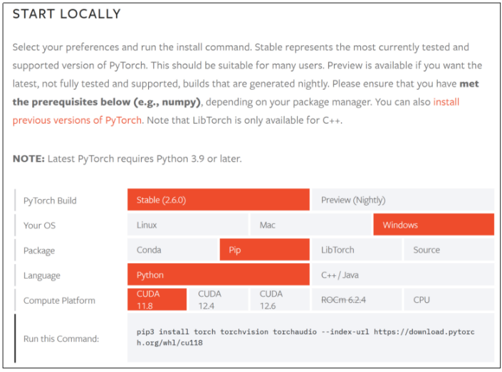

#### 6.2.1 CPU版本PyTorch安装

直接通过pip命令安装即可：

```shell
pip3 install torch torchvision torchaudio
```

若需要离线安装，可以考虑下载whl包然后自行安装。下载whl的链接：https://download.pytorch.org/whl/torch/；

手动下载whl时，需要注意PyTorch与torchvision之间版本对应关系。可以到https://github.com/pytorch/vision或https://pytorch.org/get-started/previous-versions/查看；

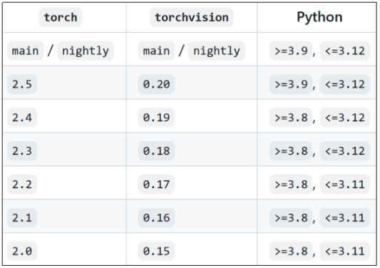

#### 6.2.2 GPU版本PyTorch安装

绝大多数情况下我们会安装GPU版本的PyTorch。目前PyTorch不仅支持NVIDIA的GPU，还支持AMD的ROCm的GPU；

安装GPU版本的PyTorch步骤：

- 根据NVIDIA驱动程序版本和要安装的PyTorch版本，确定安装哪个版本的CUDA；
- 根据CUDA版本，安装对应版本的cuDNN；

**GPU计算能力要求**

对于N卡，需要计算能力（compute capability）≥3.0；

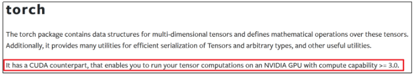

可在[https://developer.nvidia.cn/cuda-gpus#compute](#compute)查看GPU计算能力；

**CUDA版本选择**

CUDA（Compute Unified Device Architecture）是NVIDIA开发的并行计算平台和编程平台，允许开发者利用NVIDIA GPU的强大计算能力进行通用计算。CUDA不仅用于图形渲染，还广泛应用于科学计算、深度学习、金融建模等领域；

1. 根据NVIDIA驱动程序版本确定支持的最高CUDA版本

   打开NVIDIA控制面板→系统信息→组件，查看NVCUDA64.DLL的产品名称栏，可查看驱动程序支持的最高CUDA版本；

   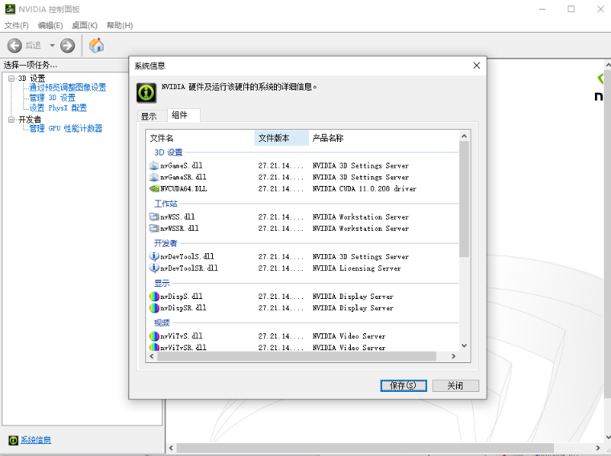

   或在命令行中输入`nvidia-smi`，在CUDA Version栏查看支持的最高CUDA版本

   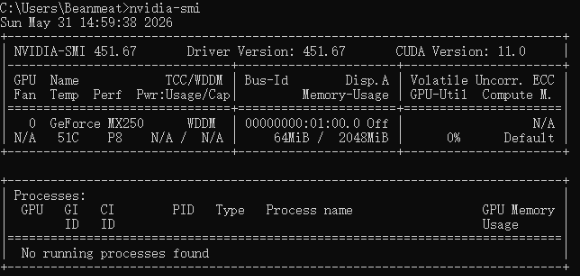

2. 根据PyTorch版本选择CUDA版本

   需要安装特定版本的CUDA版本，才能使用特定版本的PyTorch。在PyTorch下载页面可查看该版本PyTorch支持的CUDA版本

   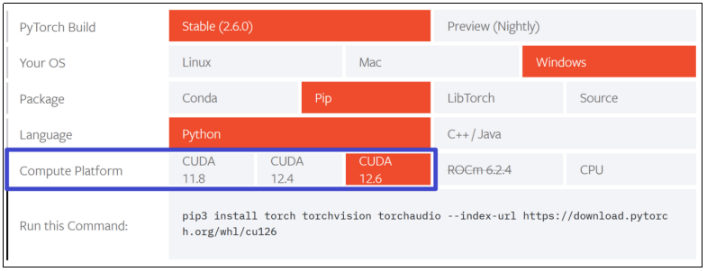

   或在https://download.pytorch.org/whl/torch/查看过往版本PyTorch支持的CUDA版本；

   例如

   

   此处的cu126表示支持CUDA12.6版本；

3. CUDA安装

   NVIDIA官网通常只展示最新的CUDA版本，过往CUDA版本可在https://developer.nvidia.com/cuda-toolkit-archive下载；

   选择相应CUDA版本后，选择要安装的平台，Installer Type安装方式选择exe(local)本地安装；

   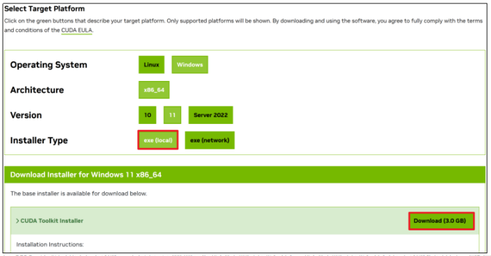

   双击.exe文件进行安装，首先需要输入临时解压路径，临时解压路径在安装结束后会自动被删除，保持默认即可。点击OK；

   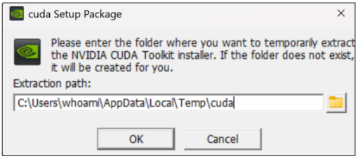

   若在系统检查环节提示“您正在安装老版本的驱动程序…”，说明安装包中包含的驱动程序版本比当前已安装的驱动程序的版本旧，可忽略。点击继续；

   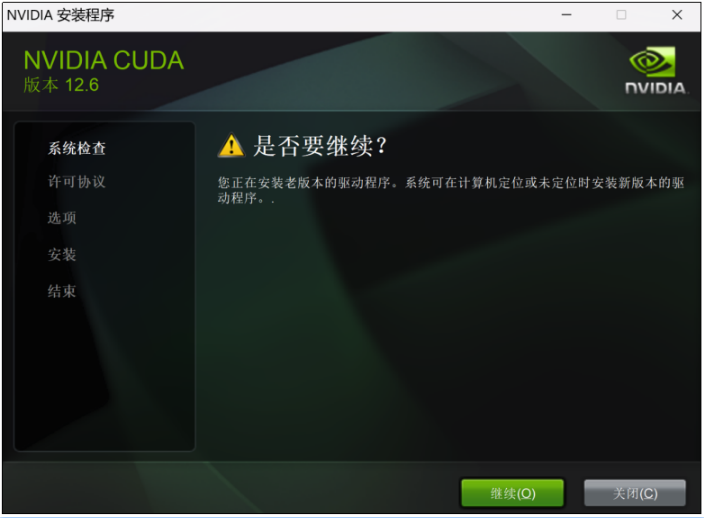

   同意安装协议并继续；

   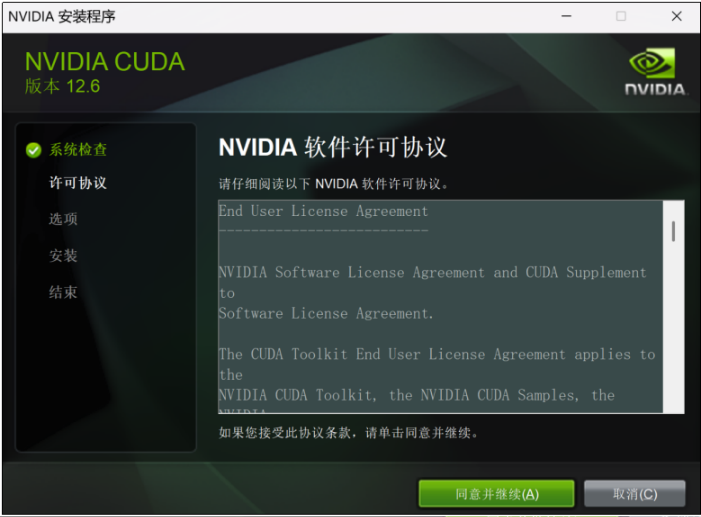

   选择精简，会安装所有组件并覆盖现有驱动程序。点击下一步；

   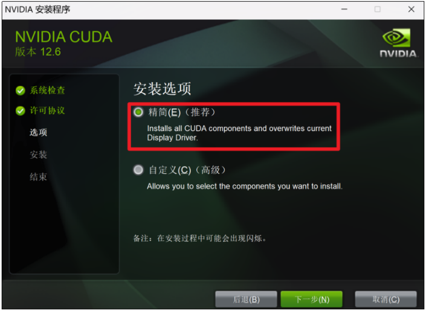

   如果出现以下提示，表明缺少Visual Studio，部分组件不能正常工作。不用在意，选择I understand…。点击Next；

   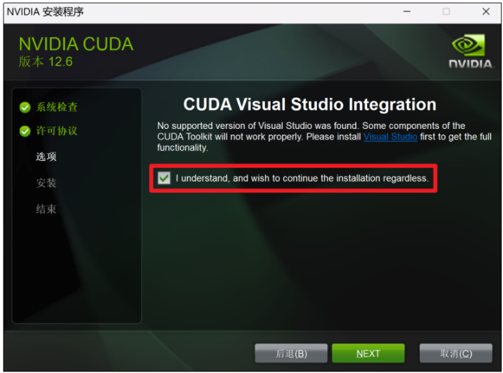

   点击下一步；

   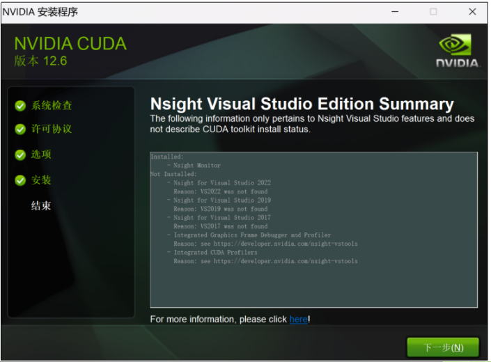

   安装完成，点击关闭；

4. cuDNN安装

   cuDNN（NVIDIA CUDA Deep Neural Network library，深度神经网络库）是用于深度神经网络的GPU加速原语库。cuDNN为标准例程 (如前向和反向卷积、注意力、matmul、池化和归一化) 提供了高度调优的实现；

   cuDNN下载地址：https://developer.nvidia.com/cudnn-archive；

   cuDNN下载后是一个压缩包，解压后包含bin、include、lib三个文件夹。

   找到CUDA安装目录，默认在C:\Program Files\NVIDIA GPU Computing Toolkit\CUDA\v12.6；

   分别将cuDNN的bin、include、lib\x64文件夹中的文件拷贝到CUDA的bin、include、lib\x64文件夹中。

   下面验证cuDNN是否安装成功。进入C:\Program Files\NVIDIA GPU Computing Toolkit\CUDA\v12.6\extras\demo_suite目录下，打开命令行，分别执行deviceQuery.exe与bandwidthTest.exe。如果出现类似下图的输出则说明安装成功；

   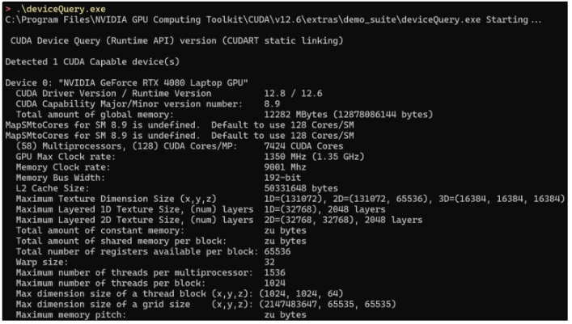

   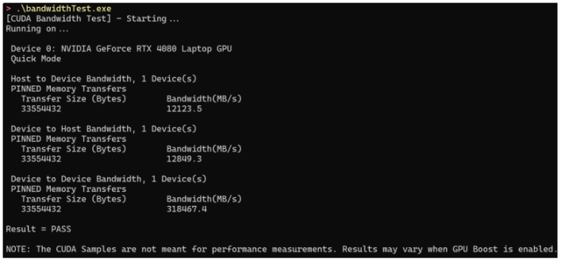

5. PyTorch安装

   新建一个虚拟环境来安装PyTorch。

   在命令行输入conda create -n pytorch-2.6.0-gpu python=3.12创建一个环境名为pytorch-2.6.0-gpu，Python版本为3.12的虚拟环境。

   使用conda activate pytorch-2.6.0-gpu激活pytorch-2.6.0-gpu虚拟环境。

   在官网https://pytorch.org/get-started选择要安装的版本，复制命令，在命令行中执行以安装PyTorch；

   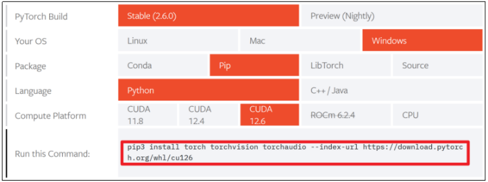

   若安装速度较慢或安装失败，可配置pip的国内镜像源pip config set global.index-url https://pypi.tuna.tsinghua.edu.cn/simple。

   要在新的虚拟环境中使用Jupyter Notebook，需使用conda install jupyter notebook安装。

   编写代码时需在IDE中选择新创建的虚拟环境作为Python解释器

### 6.3 张量创建
