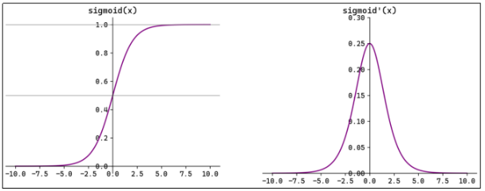
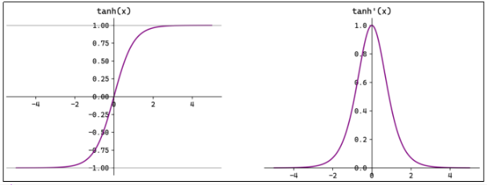
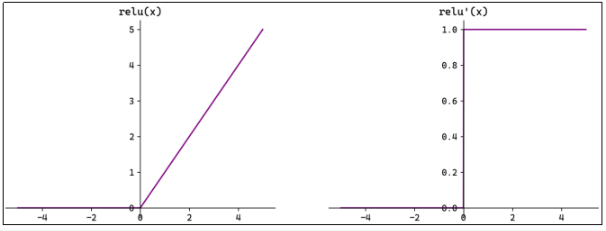
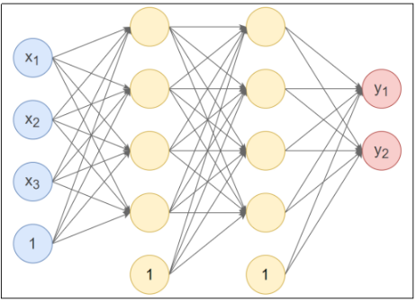
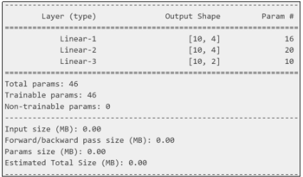

## 第07章_用PyTorch进行深度学习

------

### 7.1 激活函数

PyTorch中已经实现了神经网络中可能用到的各种激活函数，我们在代码中只要直接调用即可；

#### 7.1.1 Sigmoid函数

$$
f(x) = \frac{1}{1 + e^{-x}}
$$

$$
f'(x) = \frac{1}{1 + e^{-x}} \left( 1 - \frac{1}{1 + e^{-x}} \right) = f(x)(1 - f(x))
$$



Sigmoid函数与其导数图像绘制代码：

```python
import torch
import matplotlib.pyplot as plt

x = torch.linspace(-10, 10, 1000, requires_grad=True)
fig, ax = plt.subplots(1, 2)
fig.set_size_inches(12, 4)

ax[0].plot(x.data, torch.sigmoid(x).data, "purple")
ax[0].set_title("sigmoid(x)")
ax[0].spines["top"].set_visible(False)
ax[0].spines["right"].set_visible(False)
ax[0].spines["left"].set_position("zero")
ax[0].spines["bottom"].set_position("zero")
ax[0].axhline(0.5, color="gray", alpha=0.7, linewidth=1)
ax[0].axhline(1, color="gray", alpha=0.7, linewidth=1)

torch.sigmoid(x).sum().backward()  # 反向传播计算梯度
ax[1].plot(x.data, x.grad, "purple")
ax[1].set_title("sigmoid'(x)")
ax[1].spines["top"].set_visible(False)
ax[1].spines["right"].set_visible(False)
ax[1].spines["left"].set_position("zero")
ax[1].spines["bottom"].set_position("zero")
ax[1].set_ylim(0, 0.3)

plt.show()
```

#### 7.1.2 Tanh函数

$$
f(x) = \frac{1 - e^{-2x}}{1 + e^{-2x}}
$$

$$
f'(x) = 1 - \left( \frac{1 - e^{-2x}}{1 + e^{-2x}} \right)^2 = 1 - f^2(x)
$$



Tanh函数与其导数图像绘制代码：

```python
import torch
import matplotlib.pyplot as plt

x = torch.linspace(-5, 5, 1000, requires_grad=True)
fig, ax = plt.subplots(1, 2)
fig.set_size_inches(12, 4)

ax[0].plot(x.data, torch.tanh(x).data, "purple")
ax[0].set_title("tanh(x)")
ax[0].spines["top"].set_visible(False)
ax[0].spines["right"].set_visible(False)
ax[0].spines["left"].set_position("zero")
ax[0].spines["bottom"].set_position("zero")
ax[0].axhline(-1, color="gray", alpha=0.7, linewidth=1)
ax[0].axhline(1, color="gray", alpha=0.7, linewidth=1)

torch.tanh(x).sum().backward()  # 反向传播计算梯度
ax[1].plot(x.data, x.grad, "purple")
ax[1].set_title("tanh'(x)")
ax[1].spines["top"].set_visible(False)
ax[1].spines["right"].set_visible(False)
ax[1].spines["left"].set_position("zero")
ax[1].spines["bottom"].set_position("zero")

plt.show()
```

#### 7.1.3 ReLU函数

$$
f(x) = \max(0, x)
$$

$$
f'(x) = 
\begin{cases} 
0, & x \leq 0 \\
1, & x > 0 
\end{cases}
$$

注意：x=0时ReLU函数不可导，此时我们默认使用左侧的函数；



ReLU函数与其导数图像绘制代码：

```python
import torch
import matplotlib.pyplot as plt

x = torch.linspace(-5, 5, 1000, requires_grad=True)
fig, ax = plt.subplots(1, 2)
fig.set_size_inches(12, 4)

ax[0].plot(x.data, torch.relu(x).data, "purple")
ax[0].set_title("relu(x)")
ax[0].spines["top"].set_visible(False)
ax[0].spines["right"].set_visible(False)
ax[0].spines["left"].set_position("zero")
ax[0].spines["bottom"].set_position("zero")

torch.relu(x).sum().backward()  # 反向传播计算梯度
ax[1].plot(x.data, x.grad, "purple")
ax[1].set_title("relu'(x)")
ax[1].spines["top"].set_visible(False)
ax[1].spines["right"].set_visible(False)
ax[1].spines["left"].set_position("zero")
ax[1].spines["bottom"].set_position("zero")

plt.show()
```

#### 7.1.4 Softmax函数

$$
f(x_i) = \frac{e^{z_i}}{\sum_{j=1}^n e^{z_j}}
$$

$$
\frac{\partial f(x_i)}{\partial z_j} = 
\begin{cases} 
f(x_i) \left(1 - f(x_j)\right), & i = j \\ 
-f(x_i)f(x_j), & i \neq j 
\end{cases}
$$

Softmax函数直接调用即可，代码略；

### 7.2 搭建神经网络

#### 7.2.1 自定义模型

在神经网络框架中，由多个层组成的组件称之为 **模块 (Module)**。

在 PyTorch 中模型就是一个 Module，各网络层、模块也是 Module。Module 是所有神经网络的基类。

在定义一个 Module 时，我们需要继承 torch.nn.Module 并主要实现两个方法：

- `__init__`：定义网络各层的结构，并初始化参数。
- `forward`：根据输入进行前向传播，并返回输出。计算其输出关于输入的梯度，可通过其反向传播函数进行访问（通常自动发生）。`forward` 方法是每次调用的具体实现。

接下来使用 PyTorch 实现下图的神经网络：



第 1 个隐藏层：使用 Xavier 正态分布初始化权重，激活函数使用 Tanh。

第 2 个隐藏层：使用 He 正态分布初始化权重，激活函数使用 ReLU。

输出层：按默认方式初始化，激活函数使用 Softmax。

```python
import torch
import torch.nn as nn

class Model(nn.Module):
    # 初始化
    def __init__(self):
        super(Model, self).__init__()  # 调用父类初始化
        self.linear1 = nn.Linear(3, 4)  # 第1个隐藏层，3个输入，4个输出
        nn.init.xavier_normal_(self.linear1.weight)  # 初始化权重参数
        self.linear2 = nn.Linear(4, 4)  # 第2个隐藏层，4个输入，4个输出
        nn.init.kaiming_normal_(self.linear2.weight)  # 初始化权重参数
        self.out = nn.Linear(4, 2)  # 输出层，4个输入，2个输出，默认使用He均匀分布初始化

    # 前向传播
    def forward(self, x):
        x = self.linear1(x)  # 经过第1个隐藏层
        x = torch.tanh(x)  # 激活函数
        x = self.linear2(x)  # 经过第2个隐藏层
        x = torch.relu(x)  # 激活函数
        x = self.out(x)  # 经过输出层
        x = torch.softmax(x, dim=1)  # 激活函数
        return x

model = Model()
output = model(torch.randn(10, 3))
print("输出：\n", output)
print()

# 使用named_parameters()查看各层参数
print("模型参数：")
for name, param in model.named_parameters():
    print(name, param)
    print()

# 使用state_dict()查看各层参数
print("模型参数：\n", model.state_dict())
```

#### 7.2.2 查看模型结构和参数数量

可使用`torchsummary.summary`来查看模型结构与参数数量。需要先安装`torchsummary`库：`pip install torchsummary`；

```python
from torchsummary import summary

# input_size:特征数，batch_size:样本数
summary(model, input_size=(3,), batch_size=10, device="cpu")
```



以第1个隐藏层为例：每个节点有3个权重与1个偏置，计4个参数，4个节点共计16个参数；

#### 7.2.3 使用Sequential构建模型

可以通过torch.nn.Sequential来构建模型，将各层按顺序传入；

```python
# 构建模型
model = nn.Sequential(
    nn.Linear(3, 4),
    nn.Tanh(),
    nn.Linear(4, 4),
    nn.ReLU(),
    nn.Linear(4, 2),
    nn.Softmax(dim=1),
)

# 初始化参数
def init_weights(m):
    # 对Linear层进行初始化
    if type(m) == nn.Linear:
        nn.init.xavier_uniform_(m.weight)
        m.bias.data.fill_(0.01)

model.apply(init_weights)  # apply会遍历所有子模块并依次调用函数

output = model(torch.randn(10, 3))
print("输出：\n", output)
```

Sequential类使模型构造变得简单，不必自定义类就可以组合新的架构。然而并不是所有的架构都是简单的顺序架构，当需要更强的灵活性时还是需要自定义模型；

