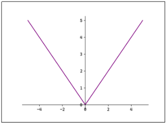
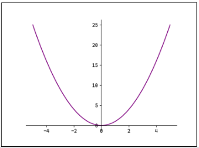
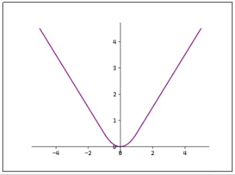
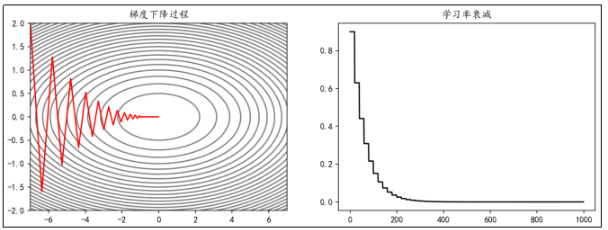
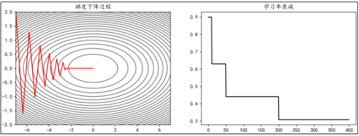
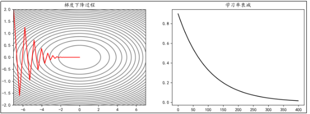
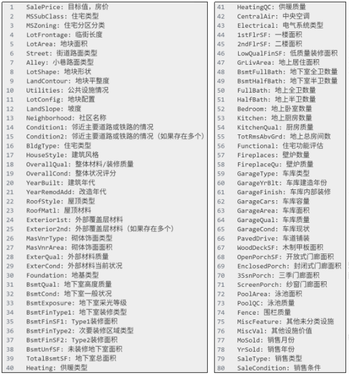

## 第07章_用PyTorch进行深度学习

------

### 7.1 激活函数

PyTorch中已经实现了神经网络中可能用到的各种激活函数，我们在代码中只要直接调用即可；

#### 7.1.1 Sigmoid函数

$$
f(x) = \frac{1}{1 + e^{-x}}
$$

$$
f'(x) = \frac{1}{1 + e^{-x}} \left( 1 - \frac{1}{1 + e^{-x}} \right) = f(x)(1 - f(x))
$$


Sigmoid函数与其导数图像绘制代码：

```python
import torch
import matplotlib.pyplot as plt

x = torch.linspace(-10, 10, 1000, requires_grad=True)
fig, ax = plt.subplots(1, 2)
fig.set_size_inches(12, 4)

ax[0].plot(x.data, torch.sigmoid(x).data, "purple")
ax[0].set_title("sigmoid(x)")
ax[0].spines["top"].set_visible(False)
ax[0].spines["right"].set_visible(False)
ax[0].spines["left"].set_position("zero")
ax[0].spines["bottom"].set_position("zero")
ax[0].axhline(0.5, color="gray", alpha=0.7, linewidth=1)
ax[0].axhline(1, color="gray", alpha=0.7, linewidth=1)

torch.sigmoid(x).sum().backward()  # 反向传播计算梯度
ax[1].plot(x.data, x.grad, "purple")
ax[1].set_title("sigmoid'(x)")
ax[1].spines["top"].set_visible(False)
ax[1].spines["right"].set_visible(False)
ax[1].spines["left"].set_position("zero")
ax[1].spines["bottom"].set_position("zero")
ax[1].set_ylim(0, 0.3)

plt.show()
```

#### 7.1.2 Tanh函数

$$
f(x) = \frac{1 - e^{-2x}}{1 + e^{-2x}}
$$

$$
f'(x) = 1 - \left( \frac{1 - e^{-2x}}{1 + e^{-2x}} \right)^2 = 1 - f^2(x)
$$


Tanh函数与其导数图像绘制代码：

```python
import torch
import matplotlib.pyplot as plt

x = torch.linspace(-5, 5, 1000, requires_grad=True)
fig, ax = plt.subplots(1, 2)
fig.set_size_inches(12, 4)

ax[0].plot(x.data, torch.tanh(x).data, "purple")
ax[0].set_title("tanh(x)")
ax[0].spines["top"].set_visible(False)
ax[0].spines["right"].set_visible(False)
ax[0].spines["left"].set_position("zero")
ax[0].spines["bottom"].set_position("zero")
ax[0].axhline(-1, color="gray", alpha=0.7, linewidth=1)
ax[0].axhline(1, color="gray", alpha=0.7, linewidth=1)

torch.tanh(x).sum().backward()  # 反向传播计算梯度
ax[1].plot(x.data, x.grad, "purple")
ax[1].set_title("tanh'(x)")
ax[1].spines["top"].set_visible(False)
ax[1].spines["right"].set_visible(False)
ax[1].spines["left"].set_position("zero")
ax[1].spines["bottom"].set_position("zero")

plt.show()
```

#### 7.1.3 ReLU函数

$$
f(x) = \max(0, x)
$$

$$
f'(x) = 
\begin{cases} 
0, & x \leq 0 \\
1, & x > 0 
\end{cases}
$$

注意：x=0时ReLU函数不可导，此时我们默认使用左侧的函数；


ReLU函数与其导数图像绘制代码：

```python
import torch
import matplotlib.pyplot as plt

x = torch.linspace(-5, 5, 1000, requires_grad=True)
fig, ax = plt.subplots(1, 2)
fig.set_size_inches(12, 4)

ax[0].plot(x.data, torch.relu(x).data, "purple")
ax[0].set_title("relu(x)")
ax[0].spines["top"].set_visible(False)
ax[0].spines["right"].set_visible(False)
ax[0].spines["left"].set_position("zero")
ax[0].spines["bottom"].set_position("zero")

torch.relu(x).sum().backward()  # 反向传播计算梯度
ax[1].plot(x.data, x.grad, "purple")
ax[1].set_title("relu'(x)")
ax[1].spines["top"].set_visible(False)
ax[1].spines["right"].set_visible(False)
ax[1].spines["left"].set_position("zero")
ax[1].spines["bottom"].set_position("zero")

plt.show()
```

#### 7.1.4 Softmax函数

$$
f(x_i) = \frac{e^{z_i}}{\sum_{j=1}^n e^{z_j}}
$$

$$
\frac{\partial f(x_i)}{\partial z_j} = 
\begin{cases} 
f(x_i) \left(1 - f(x_j)\right), & i = j \\ 
-f(x_i)f(x_j), & i \neq j 
\end{cases}
$$

Softmax函数直接调用即可，代码略；

### 7.2 搭建神经网络

#### 7.2.1 自定义模型

在神经网络框架中，由多个层组成的组件称之为 **模块 (Module)**。

在 PyTorch 中模型就是一个 Module，各网络层、模块也是 Module。Module 是所有神经网络的基类。

在定义一个 Module 时，我们需要继承 torch.nn.Module 并主要实现两个方法：

- `__init__`：定义网络各层的结构，并初始化参数。
- `forward`：根据输入进行前向传播，并返回输出。计算其输出关于输入的梯度，可通过其反向传播函数进行访问（通常自动发生）。`forward` 方法是每次调用的具体实现。

接下来使用 PyTorch 实现下图的神经网络：


第 1 个隐藏层：使用 Xavier 正态分布初始化权重，激活函数使用 Tanh。

第 2 个隐藏层：使用 He 正态分布初始化权重，激活函数使用 ReLU。

输出层：按默认方式初始化，激活函数使用 Softmax。

```python
import torch
import torch.nn as nn

class Model(nn.Module):
    # 初始化
    def __init__(self):
        super(Model, self).__init__()  # 调用父类初始化
        self.linear1 = nn.Linear(3, 4)  # 第1个隐藏层，3个输入，4个输出
        nn.init.xavier_normal_(self.linear1.weight)  # 初始化权重参数
        self.linear2 = nn.Linear(4, 4)  # 第2个隐藏层，4个输入，4个输出
        nn.init.kaiming_normal_(self.linear2.weight)  # 初始化权重参数
        self.out = nn.Linear(4, 2)  # 输出层，4个输入，2个输出，默认使用He均匀分布初始化

    # 前向传播
    def forward(self, x):
        x = self.linear1(x)  # 经过第1个隐藏层
        x = torch.tanh(x)  # 激活函数
        x = self.linear2(x)  # 经过第2个隐藏层
        x = torch.relu(x)  # 激活函数
        x = self.out(x)  # 经过输出层
        x = torch.softmax(x, dim=1)  # 激活函数
        return x

model = Model()
output = model(torch.randn(10, 3))
print("输出：\n", output)
print()

# 使用named_parameters()查看各层参数
print("模型参数：")
for name, param in model.named_parameters():
    print(name, param)
    print()

# 使用state_dict()查看各层参数
print("模型参数：\n", model.state_dict())
```

#### 7.2.2 查看模型结构和参数数量

可使用`torchsummary.summary`来查看模型结构与参数数量。需要先安装`torchsummary`库：`pip install torchsummary`；

```python
from torchsummary import summary

# input_size:特征数，batch_size:样本数
summary(model, input_size=(3,), batch_size=10, device="cpu")
```


以第1个隐藏层为例：每个节点有3个权重与1个偏置，计4个参数，4个节点共计16个参数；

#### 7.2.3 使用Sequential构建模型

可以通过torch.nn.Sequential来构建模型，将各层按顺序传入；

```python
# 构建模型
model = nn.Sequential(
    nn.Linear(3, 4),
    nn.Tanh(),
    nn.Linear(4, 4),
    nn.ReLU(),
    nn.Linear(4, 2),
    nn.Softmax(dim=1),
)

# 初始化参数
def init_weights(m):
    # 对Linear层进行初始化
    if type(m) == nn.Linear:
        nn.init.xavier_uniform_(m.weight)
        m.bias.data.fill_(0.01)

model.apply(init_weights)  # apply会遍历所有子模块并依次调用函数

output = model(torch.randn(10, 3))
print("输出：\n", output)
```

Sequential类使模型构造变得简单，不必自定义类就可以组合新的架构。然而并不是所有的架构都是简单的顺序架构，当需要更强的灵活性时还是需要自定义模型；

### 7.3 损失函数

#### 7.3.1 分类任务损失函数

1. 二分类任务损失函数

   二分类任务常用二元交叉熵损失函数（Binary Cross-Entropy Loss）
   $$
   L = -\frac{1}{n} \sum_{i=1}^n \left( y_i \log \hat{y}_i + (1 - y_i) \log (1 - \hat{y}_i) \right)
   $$
   其中：

   - $ y_i $ 为真实值（通常为 0 或 1）
   - $ \hat{y}_i $ 为预测值（表示样本 $ i $ 为 1 的概率）

   在 PyTorch 中可使用 torch.nn.BCELoss 实现：

   ```python
   import torch
   import torch.nn as nn
   
   # 真实值
   target = torch.tensor([[1], [0], [0]], dtype=torch.float32)
   # 预测值
   input = torch.randn((3, 1))
   prediction = torch.sigmoid(input)
   # 实例化损失函数
   loss = nn.BCELoss()
   print(loss(prediction, target))
   ```

2. 多分类任务损失函数

   多分类任务常用多类交叉熵损失函数（Categorical Cross-Entropy Loss）。它是对每个类别的预测概率与真实标签之间差异的加权平均；
   $$
   L = -\frac{1}{n} \sum_{i=1}^n \sum_{c=1}^C y_{i,c} \log \hat{y}_{i,c}
   $$
   其中：

   - $ C $ 是类别数  
   - $ y_{i,c} $ 为真实值（表示 $ y_i $ 是否为类别 $ c $，通常为 0 或 1）  
   - $ \hat{y}_{i,c} $ 为预测值（表示样本 $ i $ 为类别 $ c $ 的概率）

   在 PyTorch 中可使用 torch.nn.CrossEntropyLoss 实现：

   注意：调用 torch.nn.CrossEntropyLoss 相当于调用了 torch.nn.LogSoftmax 之后再调用 torch.nn.NLLLoss。即使用 CrossEntropyLoss 时上一层的输出不需要 Softmax 激活函数，因为该损失函数会自动处理。

   ```python
   import torch
   import torch.nn as nn
   
   # 真实值为标签
   target = torch.tensor([1, 0, 3, 2, 5, 4])  # 真实值
   input = torch.randn((6, 8))  # 预测值
   loss = nn.CrossEntropyLoss()  # 实例化损失函数
   print(loss(input, target))
   
   # 真实值为概率
   target = torch.randn(6, 8).softmax(dim=1)  # 真实值
   input = torch.randn((6, 8))  # 预测值
   loss = nn.CrossEntropyLoss()  # 实例化损失函数
   print(loss(input, target))
   ```

#### 7.3.2 回归任务损失函数

1. MAE

   平均绝对误差（Mean Absolute Erro，MAE），也称L1 Loss：
   $$
   L = \frac{1}{n} \sum_{i=1}^n |y_i - \hat{y}_i|
   $$
   

   L1 Loss对异常值鲁棒，但在0点处不可导

2. MSE

   均方误差（Mean Squared Error ，MSE），也称L2 Loss：
   $$
   L = \frac{1}{n} \sum_{i=1}^n (y_i - \hat{y}_i)^2
   $$
   

   L2 Loss对异常值敏感，遇到异常值时易发生梯度爆炸

3. Smooth L1

   平滑L1：
   $$
   \text{Smooth L1} = 
   \begin{cases} 
   \frac{1}{2}(y_i - \hat{y}_i)^2, & |y_i - \hat{y}_i| < 1 \\ 
   |y_i - \hat{y}_i| - \frac{1}{2}, & |y_i - \hat{y}_i| \geq 1 
   \end{cases}
   $$
   

   当误差较小时 ($|y_i - \hat{y}_i| < 1$) 使用 L2 Loss, 使得损失函数平滑可导。当误差较大时 ($|y_i - \hat{y}_i| \geq 1$) 使用 L1 Loss 降低异常值的影响。

   示例代码：

   ```python
   import torch
   from torch import nn, optim
   
   class Model(nn.Module):
       # 初始化
       def __init__(self):
           # 调用父类初始化
           super(Model, self).__init__()
           # 全连接层
           self.linear1 = nn.Linear(5, 3)
           # 初始化权重
           self.linear1.weight.data = torch.tensor(
               [
                   [0.1, 0.2, 0.3],
                   [0.4, 0.5, 0.6],
                   [0.7, 0.8, 0.9],
                   [0.10, 1.1, 1.2],
                   [1.3, 1.4, 1.5],
               ]
           ).T
           # 初始化偏置
           self.linear1.bias.data = torch.tensor([1.0, 2.0, 3.0])
   
       # 前向传播
       def forward(self, x):
           x = self.linear1(x)
           return x
   
   # 实例化模型
   model = Model()
   # 输入值
   X = torch.tensor([[1, 2, 3, 4, 5], [6, 7, 8, 9, 10]], dtype=torch.float)
   # 目标值
   target = torch.tensor([[0, 0, 0], [0, 0, 0]], dtype=torch.float)
   # 计算出输出值
   output = model(X)
   # 损失函数
   loss = nn.MSELoss()
   # 反向传播
   loss(output, target).backward()
   # 优化器
   optimizer = optim.SGD(model.parameters(), lr=1)
   # 更新参数
   optimizer.step()
   # 清空梯度
   optimizer.zero_grad()
   # 打印参数
   for i in model.state_dict():
       print(i)
       print(model.state_dict()[i])
   print()
   
   # 根据计算图手动计算梯度并更新参数
   E = (output - target) / 3
   print(E)
   weight = torch.tensor(
       [
           [0.1, 0.2, 0.3],
           [0.4, 0.5, 0.6],
           [0.7, 0.8, 0.9],
           [0.10, 1.1, 1.2],
           [1.3, 1.4, 1.5],
       ]
   )
   weight = weight - X.T @ E
   print("weight\n", weight.T)
   bias = torch.tensor([1.0, 2.0, 3.0])
   bias = bias - E.sum(dim=0)
   print("bias\n", bias)
   ```

### 7.4 参数更新方法

#### 7.4.1 Momentum

Momentum（动量法）会保存历史梯度并给予一定的权重，使其也参与到参数更新中：
$$
V \leftarrow \alpha V - \eta \nabla
$$

$$
W \leftarrow W + V
$$

- $ V $: 历史（负）梯度的加权和  
- $ \alpha $: 历史梯度的权重  
- $ \nabla $: 当前梯度，即 $ \frac{\partial L}{\partial w} $  
- $ \eta $: 学习率  

可以通过 torch.optim.SGD() 并设置 momentum 历史梯度权重参数来使用动量法。  

以寻找 $ f(x_1, x_2) = 0.05x_1^2 + x_2^2 $ 的最小值为例：

```python
import torch
import numpy as np
import matplotlib.pyplot as plt

def momentum(X, lr, momentum, n_iters):
    """动量法手动实现"""
    X_arr = X.detach().numpy().copy()  # 拷贝，用于记录优化过程
    V = torch.zeros_like(X)  # 存放历史梯度信息
    for epoch in range(n_iters):
        grad = 2 * X * w.T  # 当前梯度
        V = momentum * V + grad  # 加权求和
        V = V.squeeze()  # 降维
        X.data -= lr * V  # 更新参数
        X_arr = np.vstack([X_arr, X.detach().numpy()])  # 记录优化过程
    return X_arr

def gradient_descent(X, optimizer, n_iters):
    X_arr = X.detach().numpy().copy()  # 拷贝，用于记录优化过程
    for epoch in range(n_iters):
        y = X**2 @ w
        y.backward()  # 反向传播
        optimizer.step()  # 更新参数
        optimizer.zero_grad()  # 清空梯度
        X_arr = np.vstack([X_arr, X.detach().numpy()])  # 记录优化过程
    return X_arr

# 从(-7, 2)出发
X = torch.tensor([-7, 2], dtype=torch.float32, requires_grad=True)
w = torch.tensor([[0.05], [1.0]], requires_grad=True)
lr = 1e-2  # 学习率
n_iters = 500  # 迭代次数

# 普通梯度下降
X_clone = X.clone().detach().requires_grad_(True)
X_arr1 = gradient_descent(X_clone, torch.optim.SGD([X_clone], lr=lr), n_iters=n_iters)
plt.plot(X_arr1[:, 0], X_arr1[:, 1], "r")

# 动量法
X_clone = X.clone().detach().requires_grad_(True)
X_arr2 = gradient_descent(X_clone, torch.optim.SGD([X_clone], lr=lr, momentum=0.9), n_iters=n_iters)
plt.plot(X_arr2[:, 0], X_arr2[:, 1], "b")

# 动量法手动实现
X_clone = X.clone().detach().requires_grad_(True)
X_arr1 = momentum(X_clone, lr=lr, momentum=0.9, n_iters=n_iters)
plt.plot(X_arr1[:, 0], X_arr1[:, 1], c="orange", linestyle="--", linewidth=3)

# 绘制等高线图
x1_grid, x2_grid = np.meshgrid(np.linspace(-7, 7, 100), np.linspace(-2, 2, 100))
y_grid = w.detach().numpy()[0, 0] * x1_grid**2 + w.detach().numpy()[1, 0] * x2_grid**2
plt.contour(x1_grid, x2_grid, y_grid, levels=30, colors="gray")
plt.legend(["SGD", "Momentum", "Manual Momentum"])
plt.show()
```

#### 7.4.2 学习率衰减

1. 等间隔衰减

   可以通过 torch.optim.lr_scheduler.StepLR(optimizer, step_size, gamma) 来实现学习率的等间隔衰减。

   - optimizer: 要实现学习率衰减的优化器
   - step_size: 间隔
   - gamma: 衰减的比例

   例如，使学习率每隔 20 epoch 衰减为之前的 0.7:

   

   ```python
   import torch
   import numpy as np
   import matplotlib.pyplot as plt
   
   # 从(-7, 2)出发
   X = torch.tensor([-7, 2], dtype=torch.float32, requires_grad=True)
   w = torch.tensor([[0.05], [1.0]], requires_grad=True)
   lr = 0.9  # 初始学习率
   n_iters = 1000  # 迭代次数
   
   optimizer = torch.optim.SGD([X], lr=lr)
   scheduler_lr = torch.optim.lr_scheduler.StepLR(optimizer, step_size=20, gamma=0.7)  # 学习率衰减
   X_arr = X.detach().numpy().copy()  # 拷贝，用于记录优化过程
   lr_list = []  # 记录学习率变化
   for epoch in range(n_iters):
       y = X**2 @ w
       y.backward()  # 反向传播
       optimizer.step()  # 更新参数
       optimizer.zero_grad()  # 清空梯度
       X_arr = np.vstack([X_arr, X.detach().numpy()])  # 记录优化过程
       lr_list.append(optimizer.param_groups[0]["lr"])  # 记录学习率变化
       scheduler_lr.step()  # 学习率衰减
   
   plt.rcParams["font.sans-serif"] = ["KaiTi"]
   plt.rcParams["axes.unicode_minus"] = False
   fig, ax = plt.subplots(1, 2, figsize=(12, 4))
   x1_grid, x2_grid = np.meshgrid(np.linspace(-7, 7, 100), np.linspace(-2, 2, 100))
   y_grid = w.detach().numpy()[0, 0] * x1_grid**2 + w.detach().numpy()[1, 0] * x2_grid**2
   ax[0].contour(x1_grid, x2_grid, y_grid, levels=30, colors="gray")
   ax[0].plot(X_arr[:, 0], X_arr[:, 1], "r")
   ax[0].set_title("梯度下降过程")
   
   ax[1].plot(lr_list, "k")
   ax[1].set_title("学习率衰减")
   plt.show()
   ```

2. 指定间隔衰减

   可以通过 torch.optim.lr_scheduler.MultiStepLR(optimizer, milestones, gamma) 来实现学习率的指定间隔衰减。

   - optimizer: 要实现学习率衰减的优化器
   - milestones: 指定衰减的间隔
   - gamma: 衰减的比例

   例如，使学习率在 epoch 达到 $[10,50,200]$ 时衰减为之前的 0.7:

   

   ```python
   import torch
   import numpy as np
   import matplotlib.pyplot as plt
   
   # 从(-7, 2)出发
   X = torch.tensor([-7, 2], dtype=torch.float32, requires_grad=True)
   w = torch.tensor([[0.05], [1.0]], requires_grad=True)
   lr = 0.9  # 初始学习率
   n_iters = 400  # 迭代次数
   
   optimizer = torch.optim.SGD([X], lr=lr)
   scheduler_lr = torch.optim.lr_scheduler.MultiStepLR(optimizer, milestones=[10, 50, 200], gamma=0.7)  # 学习率衰减
   X_arr = X.detach().numpy().copy()  # 拷贝，用于记录优化过程
   lr_list = []  # 记录学习率变化
   for epoch in range(n_iters):
       y = X**2 @ w
       y.backward()  # 反向传播
       optimizer.step()  # 更新参数
       optimizer.zero_grad()  # 清空梯度
       X_arr = np.vstack([X_arr, X.detach().numpy()])  # 记录优化过程
       lr_list.append(optimizer.param_groups[0]["lr"])  # 记录学习率变化
       scheduler_lr.step()  # 学习率衰减
   
   plt.rcParams["font.sans-serif"] = ["KaiTi"]
   plt.rcParams["axes.unicode_minus"] = False
   fig, ax = plt.subplots(1, 2, figsize=(12, 4))
   x1_grid, x2_grid = np.meshgrid(np.linspace(-7, 7, 100), np.linspace(-2, 2, 100))
   y_grid = w.detach().numpy()[0, 0] * x1_grid**2 + w.detach().numpy()[1, 0] * x2_grid**2
   ax[0].contour(x1_grid, x2_grid, y_grid, levels=30, colors="gray")
   ax[0].plot(X_arr[:, 0], X_arr[:, 1], "r")
   ax[0].set_title("梯度下降过程")
   
   ax[1].plot(lr_list, "k")
   ax[1].set_title("学习率衰减")
   plt.show()
   ```

3. 指数衰减

   可以通过 torch.optim.lr_scheduler.ExponentialLR(optimizer, gamma) 来实现学习率的指数衰减。

   - optimizer: 要实现学习率衰减的优化器
   - gamma: 底数，学习率 ← 学习率 × gamma^epoch

   例如，使学习率以 0.99 为底数，epoch 为指数衰减：

   

   ```python
   import torch
   import numpy as np
   import matplotlib.pyplot as plt
   
   # 从(-7, 2)出发
   X = torch.tensor([-7, 2], dtype=torch.float32, requires_grad=True)
   w = torch.tensor([[0.05], [1.0]], requires_grad=True)
   lr = 0.9  # 初始学习率
   n_iters = 400  # 迭代次数
   
   optimizer = torch.optim.SGD([X], lr=lr)
   scheduler_lr = torch.optim.lr_scheduler.ExponentialLR(optimizer, gamma=0.99)  # 学习率衰减
   X_arr = X.detach().numpy().copy()  # 拷贝，用于记录优化过程
   lr_list = []  # 记录学习率变化
   for epoch in range(n_iters):
       y = X**2 @ w
       y.backward()  # 反向传播
       optimizer.step()  # 更新参数
       optimizer.zero_grad()  # 清空梯度
       X_arr = np.vstack([X_arr, X.detach().numpy()])  # 记录优化过程
       lr_list.append(optimizer.param_groups[0]["lr"])  # 记录学习率变化
       scheduler_lr.step()  # 学习率衰减
   
   plt.rcParams["font.sans-serif"] = ["KaiTi"]
   plt.rcParams["axes.unicode_minus"] = False
   fig, ax = plt.subplots(1, 2, figsize=(12, 4))
   x1_grid, x2_grid = np.meshgrid(np.linspace(-7, 7, 100), np.linspace(-2, 2, 100))
   y_grid = w.detach().numpy()[0, 0] * x1_grid**2 + w.detach().numpy()[1, 0] * x2_grid**2
   ax[0].contour(x1_grid, x2_grid, y_grid, levels=30, colors="gray")
   ax[0].plot(X_arr[:, 0], X_arr[:, 1], "r")
   ax[0].set_title("梯度下降过程")
   
   ax[1].plot(lr_list, "k")
   ax[1].set_title("学习率衰减")
   plt.show()
   ```

#### 7.4.3 AdaGrad

AdaGrad（Adaptive Gradient，自适应梯度）会为每个参数适当地调整学习率，并且随着学习的进行，梯度会逐渐减小。

$$
H \leftarrow H + \nabla^2
$$

$$
W \leftarrow W - \eta \frac{1}{\sqrt{H}} \nabla
$$

- $ H $: 历史梯度的平方和

可以通过 torch.optim.Adagrad() 来使用 AdaGrad。

同样以寻找 $ f(x_1, x_2) = 0.05x_1^2 + x_2^2 $ 的最小值为例：

```python
import torch
import numpy as np
import matplotlib.pyplot as plt

def adagrad(X, lr, n_iters):
    """AdaGrad手动实现"""
    X_arr = X.detach().numpy().copy()  # 拷贝，用于记录优化过程
    H = torch.zeros_like(X)  # 存放历史梯度信息
    for epoch in range(n_iters):
        grad = 2 * X * w.T  # 当前梯度
        grad.squeeze_()  # 降维
        H += grad**2  # 平方和
        X.data -= lr / (torch.sqrt(H) + 1e-8) * grad  # 更新参数，这里H后面加1e-8防止分母为0
        X_arr = np.vstack([X_arr, X.detach().numpy()])  # 记录优化过程
    return X_arr

def gradient_descent(X, optimizer, n_iters):
    X_arr = X.detach().numpy().copy()  # 拷贝，用于记录优化过程
    for epoch in range(n_iters):
        y = X**2 @ w
        y.backward()  # 反向传播
        optimizer.step()  # 更新参数
        optimizer.zero_grad()  # 清空梯度
        X_arr = np.vstack([X_arr, X.detach().numpy()])  # 记录优化过程
    return X_arr

# 从(-7, 2)出发
X = torch.tensor([-7, 2], dtype=torch.float32, requires_grad=True)
w = torch.tensor([[0.05], [1.0]], requires_grad=True)
lr = 0.9  # 学习率
n_iters = 500  # 迭代次数

# 普通梯度下降
X_clone = X.clone().detach().requires_grad_(True)
X_arr1 = gradient_descent(X_clone, torch.optim.SGD([X_clone], lr=lr), n_iters=n_iters)
plt.plot(X_arr1[:, 0], X_arr1[:, 1], "r")

# AdaGrad
X_clone = X.clone().detach().requires_grad_(True)
X_arr2 = gradient_descent(X_clone, torch.optim.Adagrad([X_clone], lr=lr), n_iters=n_iters)
plt.plot(X_arr2[:, 0], X_arr2[:, 1], "b")

# AdaGrad手动实现
X_clone = X.clone().detach().requires_grad_(True)
X_arr1 = adagrad(X_clone, lr=lr, n_iters=n_iters)
plt.plot(X_arr1[:, 0], X_arr1[:, 1], c="orange", linestyle="--", linewidth=3)

# 绘制等高线图
x1_grid, x2_grid = np.meshgrid(np.linspace(-7, 7, 100), np.linspace(-2, 2, 100))
y_grid = w.detach().numpy()[0, 0] * x1_grid**2 + w.detach().numpy()[1, 0] * x2_grid**2
plt.contour(x1_grid, x2_grid, y_grid, levels=30, colors="gray")
plt.legend(["SGD", "AdaGrad", "Manual AdaGrad"])
plt.show()
```

#### 7.4.4 RMSProp

RMSProp（Root Mean Square Propagation，均方根传播）是在 AdaGrad 基础上的改进，它并非将过去所有梯度一视同仁的相加，而是逐渐遗忘过去的梯度，采用指数移动加权平均，呈指数地减小过去梯度的尺度。

$$
H \leftarrow \alpha H + (1 - \alpha) \nabla^2
$$

$$
W \leftarrow W - \eta \frac{1}{\sqrt{H}} \nabla
$$

- $ H $: 历史梯度平方和的指数移动加权平均  
- $ \alpha $: 权重  

可以通过 torch.optim.RMSprop() 并设置 alpha 权重参数来使用 RMSprop。  

同样以寻找 $ f(x_1, x_2) = 0.05x_1^2 + x_2^2 $ 的最小值为例：

```python
import torch
import numpy as np
import matplotlib.pyplot as plt

def rmspropp(X, lr, alpha, n_iters):
    """rmspropp手动实现"""
    X_arr = X.detach().numpy().copy()  # 拷贝，用于记录优化过程
    H = torch.zeros_like(X)  # 存放历史梯度信息
    for epoch in range(n_iters):
        grad = 2 * X * w.T  # 当前梯度
        grad.squeeze_()  # 降维
        H = alpha * H + (1 - alpha) * grad**2  # 历史梯度平方和的指数加权平均
        X.data -= lr / (torch.sqrt(H) + 1e-8) * grad  # 更新参数，这里H后面加1e-8防止分母为0
        X_arr = np.vstack([X_arr, X.detach().numpy()])  # 记录优化过程
    return X_arr

def gradient_descent(X, optimizer, n_iters):
    X_arr = X.detach().numpy().copy()  # 拷贝，用于记录优化过程
    for epoch in range(n_iters):
        y = X**2 @ w
        y.backward()  # 反向传播
        optimizer.step()  # 更新参数
        optimizer.zero_grad()  # 清空梯度
        X_arr = np.vstack([X_arr, X.detach().numpy()])  # 记录优化过程
    return X_arr

# 从(-7, 2)出发
X = torch.tensor([-7, 2], dtype=torch.float32, requires_grad=True)
w = torch.tensor([[0.05], [1.0]], requires_grad=True)
lr = 1e-1  # 学习率
n_iters = 1000  # 迭代次数

# 普通梯度下降
X_clone = X.clone().detach().requires_grad_(True)
X_arr1 = gradient_descent(X_clone, torch.optim.SGD([X_clone], lr=lr), n_iters=n_iters)
plt.plot(X_arr1[:, 0], X_arr1[:, 1], "r")

# RMSProp
X_clone = X.clone().detach().requires_grad_(True)
X_arr2 = gradient_descent(X_clone, torch.optim.RMSprop([X_clone], lr=lr, alpha=0.99), n_iters=n_iters)
plt.plot(X_arr2[:, 0], X_arr2[:, 1], "b")

# RMSProp手动实现
X_clone = X.clone().detach().requires_grad_(True)
X_arr1 = rmspropp(X_clone, lr=lr, alpha=0.99, n_iters=n_iters)
plt.plot(X_arr1[:, 0], X_arr1[:, 1], c="orange", linestyle="--", linewidth=3)

# 绘制等高线图
x1_grid, x2_grid = np.meshgrid(np.linspace(-7, 7, 100), np.linspace(-2, 2, 100))
y_grid = w.detach().numpy()[0, 0] * x1_grid**2 + w.detach().numpy()[1, 0] * x2_grid**2
plt.contour(x1_grid, x2_grid, y_grid, levels=30, colors="gray")
plt.legend(["SGD", "RMSProp", "Manual RMSProp"])
plt.show()
```

#### 7.4.5 Adam

Adam（Adaptive Moment Estimation，自适应矩估计）融合了Momentum和AdaGrad的方法；
$$
v \leftarrow \alpha_1 v + (1 - \alpha_1) \nabla
$$

$$
h \leftarrow \alpha_2 h + (1 - \alpha_2) \nabla^2
$$

$$
\hat{v} = \frac{v}{1 - \alpha_1^t}
$$

$$
\hat{h} = \frac{h}{1 - \alpha_2^t}
$$

$$
W \leftarrow W - \eta \frac{\hat{v}}{\sqrt{h}}
$$

- $\eta$: 学习率  
- $\alpha_1, \alpha_2$: 一次动量系数和二次动量系数  
- $t$: 迭代次数，从 1 开始

可以通过torch.optim. Adam ()并设置betas权重参数元组，其中包含两个权重参数，来使用Adam；

```python
import torch
import numpy as np
import matplotlib.pyplot as plt

def adam(X, lr, betas, n_iters):
    """Adam手动实现"""
    X_arr = X.detach().numpy().copy()  # 拷贝，用于记录优化过程
    V = torch.zeros_like(X)  # 存放历史梯度信息
    H = torch.zeros_like(X)  # 存放历史梯度信息
    for epoch in range(n_iters):
        grad = 2 * X * w.T  # 当前梯度
        grad.squeeze_()  # 降维
        V = betas[0] * V + (1 - betas[0]) * grad  # 历史梯度的指数加权平均
        H = betas[1] * H + (1 - betas[1]) * grad**2  # 历史梯度平方和的指数加权平均
        V_hat = V / (1 - betas[0] ** (epoch + 1))
        H_hat = H / (1 - betas[1] ** (epoch + 1))
        X.data -= lr * V_hat / (torch.sqrt(H_hat) + 1e-8)  # 更新参数，这里H后面加1e-8防止分母为0
        X_arr = np.vstack([X_arr, X.detach().numpy()])  # 记录优化过程
    return X_arr

def gradient_descent(X, optimizer, n_iters):
    X_arr = X.detach().numpy().copy()  # 拷贝，用于记录优化过程
    for epoch in range(n_iters):
        y = X**2 @ w
        y.backward()  # 反向传播
        optimizer.step()  # 更新参数
        optimizer.zero_grad()  # 清空梯度
        X_arr = np.vstack([X_arr, X.detach().numpy()])  # 记录优化过程
    return X_arr

# 从(-7, 2)出发
X = torch.tensor([-7, 2], dtype=torch.float32, requires_grad=True)
w = torch.tensor([[0.05], [1.0]], requires_grad=True)
lr = 1e-1  # 学习率
n_iters = 1000  # 迭代次数

# 普通梯度下降
X_clone = X.clone().detach().requires_grad_(True)
X_arr1 = gradient_descent(X_clone, torch.optim.SGD([X_clone], lr=lr), n_iters=n_iters)
plt.plot(X_arr1[:, 0], X_arr1[:, 1], "r")

# Adam
X_clone = X.clone().detach().requires_grad_(True)
X_arr2 = gradient_descent(X_clone, torch.optim.Adam([X_clone], lr=lr, betas=(0.9, 0.999)), n_iters=n_iters)
plt.plot(X_arr2[:, 0], X_arr2[:, 1], "b")

# Adam手动实现
X_clone = X.clone().detach().requires_grad_(True)
X_arr1 = adam(X_clone, lr=lr, betas=(0.9, 0.999), n_iters=n_iters)
plt.plot(X_arr1[:, 0], X_arr1[:, 1], c="orange", linestyle="--", linewidth=3, alpha=0.7)

# 绘制等高线图
x1_grid, x2_grid = np.meshgrid(np.linspace(-7, 7, 100), np.linspace(-2, 2, 100))
y_grid = w.detach().numpy()[0, 0] * x1_grid**2 + w.detach().numpy()[1, 0] * x2_grid**2
plt.contour(x1_grid, x2_grid, y_grid, levels=30, colors="gray")
plt.legend(["SGD", "Adam", "Manual Adam"])
plt.show()
```

### 7.5 参数初始化和正则化

#### 7.5.1 常数初始化

所有权重参数初始化为一个常数

```python
import torch.nn as nn

linear = nn.Linear(5, 2)

# 全部参数初始化为0
nn.init.zeros_(linear.weight)
print(linear.weight)

# 全部参数初始化为1
nn.init.ones_(linear.weight)
print(linear.weight)

# 全部参数初始化为一个常数
nn.init.constant_(linear.weight, 10)
print(linear.weight)
```

注意：将权重初始值设为0将无法正确进行学习。严格地说，不能将权重初始值设成一样的值。因为这意味着反向传播时权重全部都会进行相同的更新，被更新为相同的值（对称的值）。这使得神经网络拥有许多不同的权重的意义丧失了。为了防止“权重均一化”（瓦解权重的对称结构），必须随机生成初始值；

#### 7.5.2 秩初始化

权重参数初始化为单位矩阵；

```python
import torch.nn as nn

linear = nn.Linear(5, 2)

# 参数初始化为单位矩阵
nn.init.eye_(linear.weight)
print(linear.weight)
```

#### 7.5.3 正态分布初始化

权重参数按指定均值与标准差正态分布初始化；

```python
import torch.nn as nn

linear = nn.Linear(5, 2)

# 参数初始化为按指定均值与标准差正态分布
nn.init.normal_(linear.weight, mean=0.0, std=1.0)
print(linear.weight)
```

#### 7.5.4 均匀分布初始化

权重参数在指定区间内均匀分布初始化；

```python
import torch.nn as nn

linear = nn.Linear(5, 2)

# 参数初始化为在区间内均匀分布
nn.init.uniform_(linear.weight, a=0, b=10)
print(linear.weight)
```

#### 7.5.5 Xavier初始化（也叫Glorot初始化）

Xavier 初始化根据输入和输出的神经元数量调整权重的初始范围，确保每一层的输出方差与输入方差相近。适用于 Sigmoid 和 Tanh 等激活函数，能有效缓解梯度消失或爆炸问题。

Xavier 正态分布初始化：均值为 0，标准差为 $\sqrt{\frac{2}{n_{in} + n_{out}}}$ 的正态分布。

Xavier 均匀分布初始化：区间 $[-\sqrt{\frac{6}{n_{in} + n_{out}}}, \sqrt{\frac{6}{n_{in} + n_{out}}}]$ 内均匀分布。

其中 $n_{in}$ 表示输入数，$n_{out}$ 表示输出数。

```python
import torch.nn as nn

linear = nn.Linear(5, 2)

# Xavier正态分布初始化
nn.init.xavier_normal_(linear.weight)
print(linear.weight)

# Xavier均匀分布初始化
nn.init.xavier_uniform_(linear.weight)
print(linear.weight)
```

#### 7.5.6 He初始化（也叫Kaiming初始化）

He 初始化根据输入的神经元数量调整权重的初始范围。主要适用于 ReLU 及其变体（如 Leaky ReLU）激活函数。

He 正态分布初始化：均值为 0，标准差为 $\sqrt{\frac{2}{n_{in}}}$ 的正态分布。

He 均匀分布初始化：区间 $[-\sqrt{\frac{6}{n_{in}}}, \sqrt{\frac{6}{n_{in}}}]$ 内均匀分布。

其中 $n_{in}$ 表示输入数。

```python
import torch.nn as nn

linear = nn.Linear(5, 2)

# Kaiming正态分布初始化
nn.init.kaiming_normal_(linear.weight)
print(linear.weight)

# Kaiming均匀分布初始化
nn.init.kaiming_uniform_(linear.weight)
print(linear.weight)
```

#### 7.5.7 Dropout随机失活

Dropout（随机失活，暂退法）是一种在学习的过程中随机关闭神经元的方法。

可以通过torch.nn.Dropout(p)来使用Dropout，并通过参数p来设置失活概率；

```python
import torch

dropout = torch.nn.Dropout(p=0.5)
x = torch.randint(1, 10, (10,), dtype=torch.float32)
print("Dropout前：", x)
print("Dropout后：", dropout(x))
```

### 7.6 应用案例：房价预测

先安装pandas和scikit-learn库：pip install pandas scikit-learn；

使用House Prices数据集：https://www.kaggle.com/c/house-prices-advanced-regression-techniques



#### 7.6.1 导入所需的模块

```python
import torch
import pandas as pd
import torch.nn as nn
import matplotlib.pyplot as plt
from sklearn.model_selection import train_test_split
from sklearn.pipeline import Pipeline
from sklearn.impute import SimpleImputer
from sklearn.compose import ColumnTransformer
from sklearn.preprocessing import StandardScaler, OneHotEncoder
from torch.utils.data import TensorDataset, DataLoader
```

#### 7.6.2 特征工程

对特征进行处理，数值型特征使用均值填充缺失值，再标准化；类别型特征使用字符串“NaN”填充缺失值，再独特编码。之后构造数据集；

```python
def create_dataset():
    """构造数据集"""
    # 读取数据
    data = pd.read_csv("data/house_prices.csv")
    # 去除无关特征
    data.drop(["Id"], axis=1, inplace=True)
    # 划分特征和目标
    X = data.drop("SalePrice", axis=1)
    y = data["SalePrice"]
    # 筛选出数值型特征
    numerical_features = X.select_dtypes(exclude="object").columns
    # 筛选出类别型特征
    categorical_features = X.select_dtypes(include="object").columns
    # 划分训练集和测试集
    x_train, x_test, y_train, y_test = train_test_split(X, y, test_size=0.2, random_state=42)
    # 特征预处理
    #   数值型特征先用平均值填充缺失值，再进行标准化
    numerical_transformer = Pipeline(
        steps=[
            ("fillna", SimpleImputer(strategy="mean")),
            ("std", StandardScaler()),
        ]
    )
    #   类别型特征先将缺失值替换为字符串"NaN"，再进行独热编码
    categorical_transformer = Pipeline(
        steps=[
            ("fillna", SimpleImputer(strategy="constant", fill_value="NaN")),
            ("onehot", OneHotEncoder(handle_unknown="ignore")),
        ]
    )
    #   组合特征预处理器
    preprocessor = ColumnTransformer(
        transformers=[
            ("num", numerical_transformer, numerical_features),
            ("cat", categorical_transformer, categorical_features),
        ]
    )
    #   进行特征预处理
    x_train = pd.DataFrame(preprocessor.fit_transform(x_train).toarray(), columns=preprocessor.get_feature_names_out())
    x_test = pd.DataFrame(preprocessor.transform(x_test).toarray(), columns=preprocessor.get_feature_names_out())
    # 构建数据集
    train_dataset = TensorDataset(torch.tensor(x_train.values).float(), torch.tensor(y_train.values).float())
    test_dataset = TensorDataset(torch.tensor(x_test.values).float(), torch.tensor(y_test.values).float())
    # 返回训练集，测试集，特征数量
    return train_dataset, test_dataset, x_train.shape[1]

train_dataset, test_dataset, feature_num = create_dataset()
```

#### 7.6.3 搭建模型

```python
# 搭建模型
model = nn.Sequential(
    nn.Linear(feature_num, 128),
    nn.BatchNorm1d(128),
    nn.ReLU(),
    nn.Dropout(0.2),
    nn.Linear(128, 1),
)
```

#### 7.6.4 损失函数

关于房价的预测我们更加关心相对误差 $\frac{\hat{y} - y}{y}$ 而非绝对误差 $\hat{y} - y$，比如房价原本 20 万元而误差 10 万元，那么误差可能难以接受；但若房价原本 1000 万元而误差为 10 万元，那误差可能并不算大。因此这里我们使用对数来衡量误差：

$$
\text{Loss} = \sqrt{\frac{1}{n} \sum_{i=1}^n (\log \hat{y} - \log y)^2}
$$

```python
# 损失函数
def log_rmse(pred, target):
    mse = nn.MSELoss()
    pred.squeeze_()
    pred = torch.clamp(pred, 1, float("inf"))  # 限制输出在1到正无穷之间
    return torch.sqrt(mse(torch.log(pred), torch.log(target)))
```

#### 7.6.5 模型训练

```python
# 模型训练
def train(model, train_dataset, test_dataset, lr, epoch_num, batch_size, device):
    def init_weight(layer):
        # 对线性层的权重进行初始化
        if type(layer) == nn.Linear:
            nn.init.xavier_normal_(layer.weight)

    model.apply(init_weight)  # 初始化参数
    model = model.to(device)  # 将模型加载到设备中
    optimizer = torch.optim.Adam(model.parameters(), lr=lr)  # 优化器

    train_loss_list = []  # 记录训练损失
    test_loss_list = []  # 记录验证损失
    for epoch in range(epoch_num):

        # 训练过程
        model.train()  # 将模型设置为训练模式
        train_loader = DataLoader(train_dataset, batch_size=batch_size, shuffle=True)
        train_loss_accumulate = 0
        # 训练模型
        for batch_count, (X, y) in enumerate(train_loader):
            # 前向传播
            X, y = X.to(device), y.to(device)
            output = model(X)
            # 反向传播
            loss_value = log_rmse(output, y)
            optimizer.zero_grad()
            loss_value.backward()
            optimizer.step()
            # 累加损失
            train_loss_accumulate += loss_value.item()
            # 打印进度条
            print(f"\repoch:{epoch:0>3}[{'='*(int((batch_count+1) / len(train_loader)* 50 )):<50}]", end="")
        this_train_loss = train_loss_accumulate / len(train_loader)  # 计算平均损失
        train_loss_list.append(this_train_loss)  # 记录训练损失

        # 验证过程
        model.eval()  # 将模型设置为评估模式
        test_loader = DataLoader(dataset=test_dataset, batch_size=batch_size, shuffle=True)
        test_loss_accumulate = 0
        with torch.no_grad():  # 关闭梯度计算
            for X, y in test_loader:
                # 前向传播
                X, y = X.to(device), y.to(device)
                output = model(X)
                # 累加损失
                test_loss_accumulate += loss_value.item()
        this_test_loss = test_loss_accumulate / len(test_loader)  # 计算平均损失
        test_loss_list.append(this_train_loss)  # 记录验证损失

        # 打印训练损失，验证损失
        print(f" train_loss:{this_train_loss:.6f}, test_loss:{this_test_loss:.6f}")
    return train_loss_list, test_loss_list

device = torch.device("cuda" if torch.cuda.is_available() else "cpu")  # 如果cude可用则使用cuda，否则使用cpu
train_loss_list, test_loss_list = train(model, train_dataset, test_dataset, 0.1, 200, 64, device)
plt.plot(train_loss_list, "r-", label="train_loss", linewidth=3)  # 绘制训练损失
plt.plot(test_loss_list, "k--", label="test_loss", linewidth=2)  # 绘制验证损失
plt.legend()
plt.show()
```

